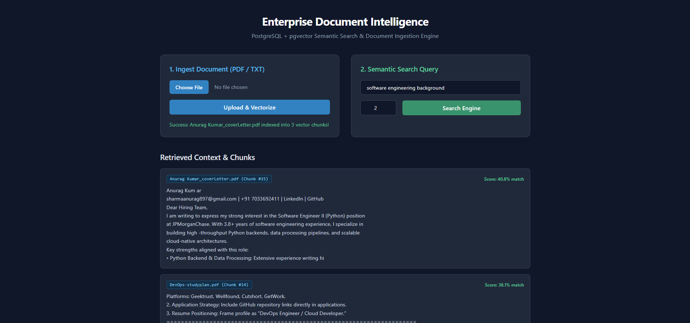
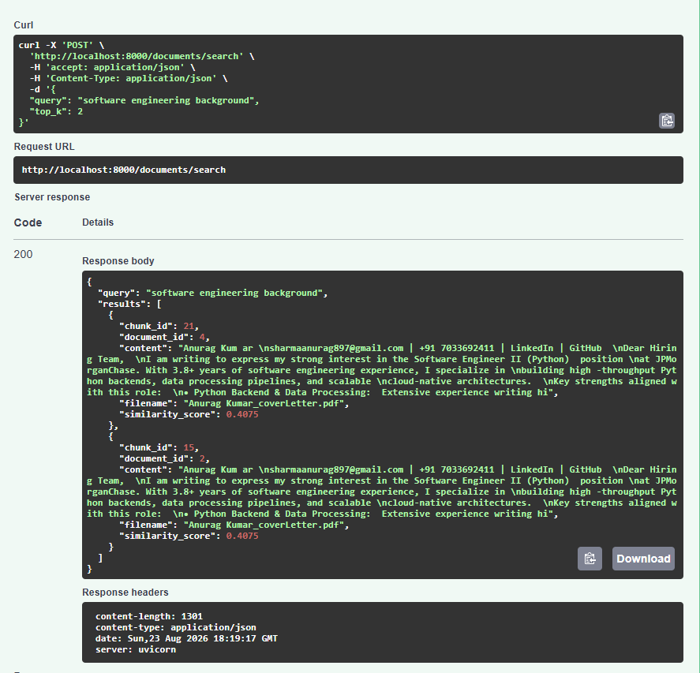
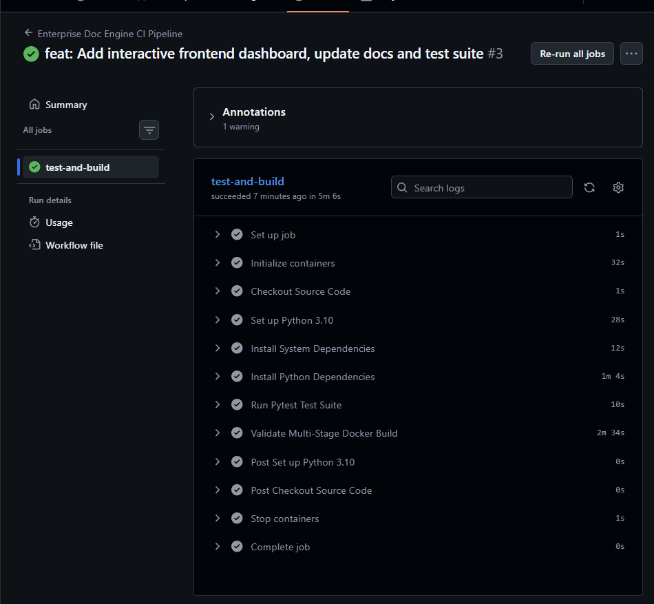
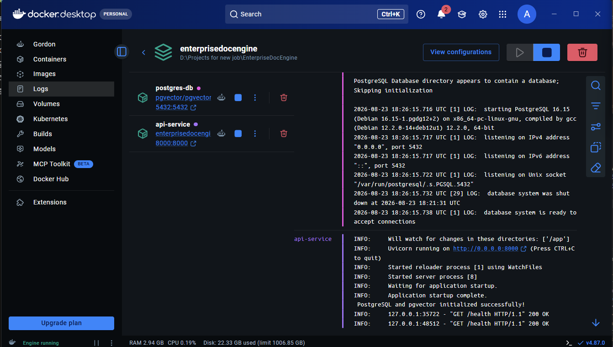
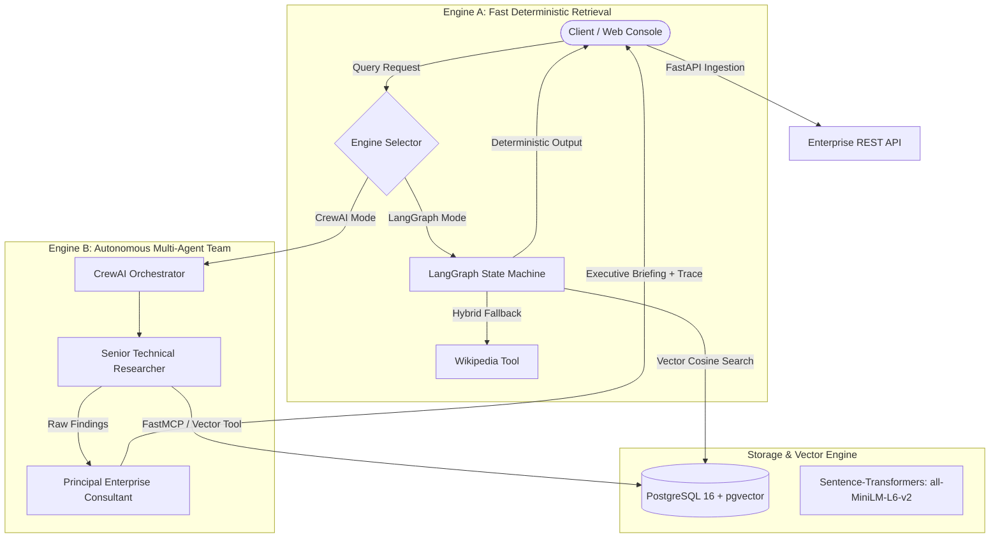

## System Architecture & Live Previews

| Interactive Web Dashboard | Swagger API Execution |
|:---:|:---:|
|  |  |

| CI/CD Pipeline (GitHub Actions) | Docker Multi-Container Orchestration |
|:---:|:---:|
|  |  |


# ⚡ EnterpriseDocEngine
> Enterprise-Grade Multi-Agent Document Retrieval, RAG & MCP Intelligence Platform

An end-to-end containerized intelligence engine combining **PostgreSQL `pgvector`**, **FastMCP (Model Context Protocol)**, **LangGraph Deterministic State Machine**, and **CrewAI Autonomous Multi-Agent Synthesis**.

---

## 🏗️ System Architecture




## 🛠️ Tech Stack & Architecture

| Layer | Component / Tool | Primary Responsibility |
| :--- | :--- | :--- |
| **API & Server** | `FastAPI`, `Uvicorn` | Asynchronous REST endpoints, multipart ingestion, and routing |
| **Data Validation** | `Pydantic v2` | Strict schema validation for requests and agent contracts |
| **Vector Storage** | `PostgreSQL 16` + `pgvector` | Native vector indexing, metadata persistence, and cosine distance search |
| **ORM Layer** | `SQLAlchemy 2.0` | Relational entity mappings and transactional database sessions |
| **Deterministic Agent** | `LangGraph` | Stateful conditional graph with document grounding and web search fallback |
| **Multi-Agent Orchestration** | `CrewAI` | Autonomous sequential multi-agent execution (Researcher + Writer) |
| **Protocol Integration** | `FastMCP` | Standardized Model Context Protocol tool exposure for pgvector |
| **Embeddings** | `Sentence-Transformers` (`all-MiniLM-L6-v2`)| 384-dimensional dense semantic chunk vectorization |
| **Large Language Models** | `Ollama` (`Phi-3:mini`), `OpenAI` (`GPT-4o-mini`) | Local private inference and enterprise executive synthesis |
| **Parsing & Utilities** | `pypdf`, `python-multipart` | Binary PDF parsing, text extraction, and chunk boundary normalization |
| **Frontend UI** | `TailwindCSS`, `Marked.js` | OLED Charcoal responsive console with real-time agent trace viewing |
| **Infrastructure** | `Docker`, `Docker Compose`, `WSL2` | Multi-container isolation, health check orchestration, and volume caching |
| **Testing** | `Pytest`, `FastAPI TestClient` | End-to-end integration and API contract verification suite |


## Key Features
Hybrid Execution Engines:

LangGraph Agent: Low-latency, deterministic routing with cosine similarity retrieval and automatic web fallback.

CrewAI Multi-Agent Team: Autonomous multi-turn research, source cross-referencing, and executive briefing synthesis.

Vector Store & Ingestion: Containerized PostgreSQL with pgvector, chunking text/PDFs with sub-second vector cosine indexing.

FastMCP Architecture: Model Context Protocol abstraction layer exposing PostgreSQL vector tools standardly across agent frameworks.

Full Agent Transparency: Frontend displays collapsible execution traces showing exact agent actions, tools used, and status steps.

Modern Dark UI: Tailored OLED Charcoal console with zero external frontend dependencies.


## Quick Start with Docker
1. Clone the repository
```bash
git clone [https://github.com/your-username/EnterpriseDocEngine.git](https://github.com/your-username/EnterpriseDocEngine.git)
cd EnterpriseDocEngine
```
Create .env:
```bash
OPENAI_API_KEY=your_openai_api_key_here
```


## 2. Start the Application
```bash
docker compose up -d --build
```

## The services will initialize:

Web UI: http://localhost:8000 (or frontend/index.html)

Interactive API Docs: http://localhost:8000/docs


## 🧪 Running Automated Tests
The engine includes a full integration test suite verifying file chunking, pgvector cosine search, LangGraph routing, and CrewAI contract integrity:

```bash
docker compose exec -e PYTHONPATH=/app api-service pytest tests/test_enterprise_engine.py -v
```

## 📂 Project Structure
```text
EnterpriseDocEngine/
├── backend/
│   ├── app/
│   │   ├── agents/
│   │   │   ├── crew_analyst.py     # CrewAI Multi-Agent Team Pipeline
│   │   │   ├── langgraph_agent.py  # LangGraph Deterministic State Machine
│   │   │   └── mcp_server.py       # FastMCP Tool Protocol Layer
│   │   ├── database.py             # PostgreSQL Connection & Engine
│   │   ├── models.py               # SQLAlchemy pgvector Models
│   │   └── main.py                 # FastAPI Ingestion & Execution Routes
│   ├── tests/
│   │   ├── __init__.py
│   │   └── test_enterprise_engine.py # Pytest Integration Suite
│   ├── Dockerfile
│   └── requirements.txt
├── frontend/
│   └── index.html                  # OLED Charcoal Intelligence Console
├── docker-compose.yml
├── .env
└── README.md
```


## 🔌 API Endpoints

| Method | Endpoint | Description |
| :--- | :--- | :--- |
| `GET` | `/` | Serves the OLED Charcoal multi-agent console interface |
| `GET` | `/health` | Application health and database connection verification |
| `POST` | `/documents/upload` | Uploads `.pdf` or `.txt` files for chunking and pgvector indexing |
| `POST` | `/documents/search` | Direct cosine similarity vector search with `top_k` results |
| `POST` | `/agent/chat` | Executes LangGraph deterministic state machine with hybrid fallback |
| `POST` | `/crew/analyze` | Triggers CrewAI multi-agent research team and returns execution trace |


## Example Usage
1. Ingest a Document
```bash
curl -X 'POST' \
  'http://localhost:8000/documents/upload' \
  -H 'accept: application/json' \
  -H 'Content-Type: multipart/form-data' \
  -F 'file=@sample_report.pdf;type=application/pdf'
```

2. Semantic Search Query
```bash
curl -X 'POST' \
  'http://localhost:8000/documents/search' \
  -H 'Content-Type: application/json' \
  -d '{
    "query": "What are the infrastructure requirements?",
    "top_k": 3
  }'

  ```

## Testing & CI/CD Pipeline
Unit tests verify endpoint status codes and file format validation.

```bash
# Run tests locally
pytest -v backend/test_main.py
```

A GitHub Actions workflow (.github/workflows/ci.yml) runs on every push to main, validating code quality, running unit tests against a temporary pgvector service container, and building the production Docker image.

